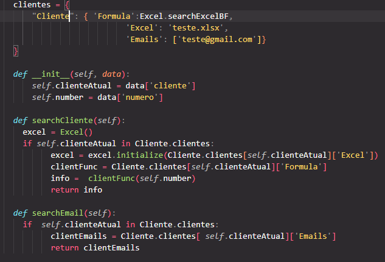

<h1>Apollo v.03</h1>

    Esse script, que carinhosamente apelidei de Apollo, é um robô de automação desenvolvido para acelerar um processo repetitivo em um site de logística. Nele, é necessário importar um arquivo, preencher alguns campos de um formulário e registrar um valor que é gerado no final pelo menos umas 30 vezes ao dia. Obviamente, o script principal do robô só funciona no site que eu configurei; ele é um software privado. Porém, as funcionalidades principais que desenvolvi e quero compartilhar com vocês estão separadas em classes, então podem ser testadas tranquilamente, basta adaptar as informações necessárias.

<h2>Funcionalidades</h2>
<h3>Excel</h3>

Como principal funcionalidade para o processo, o script foi desenvolvido para que o robô acesse um arquivo Excel, procure informações específicas e insira dados recebidos no final do processo em outra planilha.

<h3>XML</h3>

Outra parte importante do processo é o XML. O Apollo consegue procurar dados necessários dentro desses arquivos para seguir o processo, basta especificar a tag dentro da função usada.

<h3>Email</h3>

Essa função vem a partir da necessidade do tratamento de erros. Uma vez que era preciso enviar emails para os clientes caso os XMLs dos mesmos viessem com falta de informação, o Apollo consegue captar o problema e enviar o email com o anexo do arquivo para que ocorra a correção.

<h2>Requisitos</h2>

Para o funcionamento correto do robô, é necessário clonar o repositório nesse link aqui "https://github.com/GuilhermeNas2/Apollo-v.02.git",após isso devem ser criadas 3 pastas na raiz do projeto: Excel, XML, Concluídos (o nome pode variar, basta mudar ele no caminho). Também é necessário um arquivo .env contendo algumas variáveis específicas que você pode conferir abaixo.

user= "Usuário para logar no site"  
password= "Senha do usuário"  
url= "Site a ser acessado"  
pathEx, pathXml, pathImg, pathConcluidos= "Caminho das pastas que devem ser criadas no diretório raiz"  
email= "Email de quem irá enviar os emails"  
passwordEmail= "Senha criada pelo email para acesso de aplicativos de terceiros"  
emailsClientes= "Deve ser uma lista de emails [exem@gmail.com]"  

Na questão de bibliotecas, todas devem estar listadas no arquivo requirements.txt, então basta criar um venv no seu repositório e baixar todas facilmente.

<h2>Configurações</h2>

Bom, como já dito anteriormente esse código está configurado para atender as regras de negócios de um cliente, então vou comentar o que as funções fazem e o que pode ser 
alterado para funcionar com você

Basicamente essa função deve procurar em uma planilha excel um valor específico, que vem do parâmetro "data", assim que achar, a linha é salva e agora o robô deve achar as colunas referênciadas nas variáveis colunaF e colunaN (Esses valores podem ser alterados para atender a sua demanda). Curiosidade, existe uma condição dentro do "for" que verifica se o valor
da célula é float ou int, eu tive que colocar isso pois outra função da classe Excel faz mudançar no arquivo e por algum motivo que eu não sei ainda o tipo do valor nessa coluna
pode ser alterado para float. Após os valores serem encontrados, o Apollo faz uma divisão entre eles e retorna esse valor para o script principal

Essa função como o nome já diz, é usada para inserir 3 valores em uma outra planilha do mesmo Excel, básicamente uma tabela é criada com o "title" sendo um código padrão para 
os lotes de XML's que estão sendo inseridos, antes de inserir é verificado se o valor já não existe na planilha, caso não exista o script procura um espaço "limpo" para iniciar. Ao lado dele é escrito uma frase referente ao processo, e abaixo deverá ser criada uma linha com "data" que é outro código gerado quando 
o formulário é preenchido no site, é necessário que esse código tenha "/" pois o código é procura essa barra para saber qual parte da informação é relevante, caso você não precise, basta retirar o regex dessa função. Logo a frente é escrito o "valor", que nada mais é do que o resultado retornado da função anterior.

Esse método é bem simples, primeiro é preciso que seja passado como parâmetro um arquivo xml, após isso deve ser ajustado 2 valores, os dois dizem respeito ao nome da tag que leva as informações necessárias para o seu processo. Adendo, novamente eu uso regex na minha segunda tag, caso não precise basta retirar. E por último é retornado um objeto com os valores.

    Bom, o método dos emails funciona da seguinte forma nesse código, é passado como parâmetro um arquivo que é enviado como anexo da mensagem, e o cliente que o Apollo configurou com base no XML, depois disso é feito um "for" com base na lista de emails, assim enviando quantos emails forem necessários. Ps.: Eu nesse presente momento eu não se o código funciona para outros emails além do Gmail, atualizo essa parte caso seja preciso posteiormente.

    Já começo aqui pedindo desculpas por essa parte do código, como ainda não recebi aval para fazer uma banco de dados essa part preenche bem o vazio kkkk. Basicamente essa classe tem um dicionário contendo o nome do cliente, que deve ser o mesmo nome que esta no XML no meu caso, e alguns valores referentes a ele, o primeiro é uma função, pois como o objetivo desse script é satisfazer o processo de vários clientes, possivelmente algumas mudanças devem ser feitas entre eles, então é justificado que as funções possam ser dinâmicas durante todo o processo do robô. O segundo é o nome do excel que é usado para esse cliente. E por último temos uma lista com alguns emails referente a essa pessoa/empresa.

